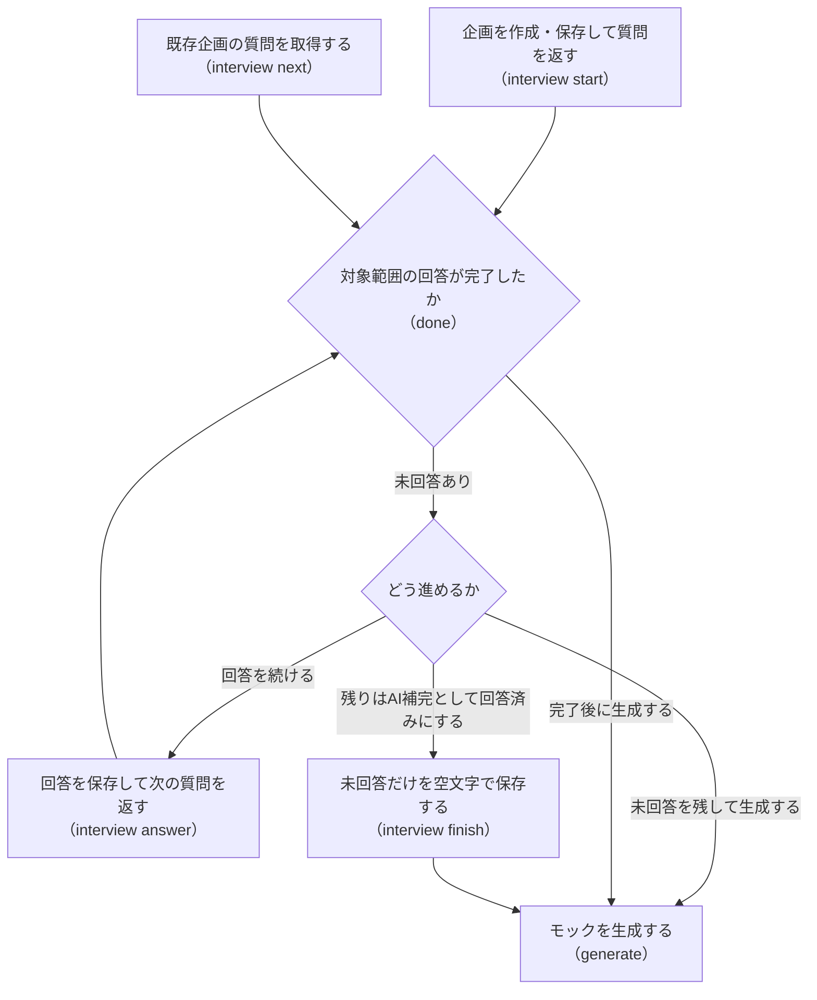

# Mosaic CLI

第1引数が `cli` のとき、Avaloniaを起動せずターミナルから企画・生成・改善を実行します。
AIエージェントは呼び出しごとに終了する `start → next → answer` を使い、人間は `ask` で連続入力できます。

## 起動

```sh
dotnet run --project GameMockStudio.csproj -- cli --help
dotnet bin/Release/net8.0/GameMockStudio.dll cli --help
```

前者はソースから起動する方法、後者はReleaseのビルド済みDLLを使う方法です。以下の例では後者を短く書きます。

```sh
mosaic() { dotnet bin/Release/net8.0/GameMockStudio.dll cli "$@"; }
```

`mosaic` または `mosaic --help` は全コマンドの使い方をstdoutへ出して終了コード0で終了します。
種類は `game | service | gamification`、形式は `browser | unity | avalonia` で、大文字小文字を区別しません。
形式の既定値は `browser`。サービスで選択できる形式は `browser` と `avalonia` です。

オプションは `--key value`、フラグは `--random` / `--none` / `--json` です。空白を含む値や空文字はシェルで引用します。
未知・重複オプションや余分な位置引数は拒否します。`--key=value` は受け付けません。

通常のJSON出力はインデント付き、プロパティ名と列挙値はcamelCase、日本語はエスケープしません。
`--json` の生成進捗だけは1行1オブジェクトのJSONLです。HTMLで特別な意味を持つ文字などはJSONエンコーダーでエスケープされます。
以下のJSON例は内蔵カタログの実際の項目・件数に合わせています。本変更のCLI実行確認は未実施です。

## カタログ

### kinds

```sh
mosaic kinds
```

```json
[
  {
    "kind": "game",
    "label": "ゲーム",
    "categoryCount": 18,
    "fieldCount": 163,
    "formats": [
      "browser",
      "unity",
      "avalonia"
    ]
  },
  {
    "kind": "service",
    "label": "サービス",
    "categoryCount": 10,
    "fieldCount": 60,
    "formats": [
      "browser",
      "avalonia"
    ]
  },
  {
    "kind": "gamification",
    "label": "ゲーミフィケーション",
    "categoryCount": 22,
    "fieldCount": 189,
    "formats": [
      "browser",
      "unity",
      "avalonia"
    ]
  }
]
```

### fields

```sh
mosaic fields --kind service
```

全カテゴリを配列で出力します。次は先頭カテゴリの抜粋です（実際の配列には10カテゴリすべてが入ります）。


```json
[
  {
    "label": "サービスの仮説",
    "description": "何を作るかを決める前に、誰のどんな変化を確かめたいかを整理します。",
    "fields": [
      {
        "identifier": "service_title",
        "label": "サービス名",
        "description": "仮の名前で構いません。",
        "example": "おすそわけノート"
      },
      {
        "identifier": "service_type",
        "label": "サービスの種類",
        "description": "SNS、業務支援、学習、生活支援など。",
        "example": "小さな地域の助け合いSNS"
      },
      {
        "identifier": "service_pitch",
        "label": "一文で表す価値",
        "description": "対象者・場面・得られる変化をつなぎます。",
        "example": "近所の人へ余った食材を手間なく譲れる"
      },
      {
        "identifier": "service_problem",
        "label": "解決したい困りごと",
        "description": "実際に困る場面を具体的にします。",
        "example": "使い切れない食材を捨ててしまう"
      },
      {
        "identifier": "service_hypothesis",
        "label": "確かめたい仮説",
        "description": "事実と推測を分け、モックで確かめる問いを書きます。",
        "example": "徒歩圏内なら譲り先を探す負担が減るのではないか"
      },
      {
        "identifier": "service_difference",
        "label": "既存手段との違い",
        "description": "現在の代替手段と、変える理由を整理します。",
        "example": "大きな掲示板より受け渡し条件を短時間で確認できる"
      }
    ]
  }
]
```

### ideas

```sh
mosaic ideas --kind game
```

番号は種類ごとに1から始まり、`interview start --idea` に渡します。


```json
[
  {
    "number": 1,
    "title": "短時間の発見パズル",
    "description": "観察して一つの違いを見つける、1分で一巡するゲーム。まず操作の分かりやすさと再挑戦の気持ちを確かめます。",
    "genres": [
      "パズル"
    ],
    "values": {
      "pitch": "1分で一つの違いを発見する観察パズル",
      "core_loop": "観察→違いを選ぶ→結果→別の問題で再挑戦",
      "validation_goal": "説明なしで操作でき、再挑戦したくなるかを確かめる"
    }
  }
]
```

## 1回1問の対話



企画ファイルへ回答を保存しながら対話を進め、未回答を残したまま生成することもできるコマンドの使い分けを示します。

### start / next

```sh
mosaic interview start --brief service.json --kind service
mosaic interview next --brief service.json
```

上記2コマンドは、新規作成後にまだ回答していなければ同じ質問JSONを返します。


```json
{
  "done": false,
  "kind": "service",
  "category": {
    "label": "サービスの仮説",
    "description": "何を作るかを決める前に、誰のどんな変化を確かめたいかを整理します。"
  },
  "field": {
    "identifier": "service_title",
    "label": "サービス名",
    "description": "仮の名前で構いません。",
    "example": "おすそわけノート"
  },
  "progress": {
    "answered": 0,
    "specified": 0,
    "total": 60
  },
  "howToAnswer": "answer --field service_title --value <text> | --random（AI補完） | --none（不採用）"
}
```

`start` はVersion 2の企画を保存します。保存先の親ディレクトリは事前に作成してください。
既存ファイルは上書きせず、終了コード1を返します。同時に別の呼び出しが作成した場合も上書きしません。
企画ファイルだけが対話状態を持つため、プロセスの保持やセッションIDは不要です。

形式・内蔵案を指定する例:

```sh
mosaic interview start --brief idea.json --kind service --format avalonia --idea 1
```

案の `Values` にある項目は回答済みとして始まります。存在しない案番号は終了コード2です。

カテゴリを限定する例:

```sh
mosaic interview next --brief service.json --category "利用者と利用場面"
```

このカテゴリの最初の未回答（初期状態では `service_users`）を返します。ラベルと項目IDは完全一致です。
`progress` はカテゴリ限定時も企画全体を表します。指定カテゴリが存在しなければ終了コード1です。

全項目に回答した後の `next`:


```json
{
  "done": true,
  "kind": "service",
  "progress": {
    "answered": 60,
    "specified": 2,
    "total": 60
  }
}
```

カテゴリを限定した場合、`done` はそのカテゴリ内の完了です。他カテゴリに未回答が残っていても `true` になります。
ゲーム・ゲーミフィケーションのジャンルが空でも、項目をすべて回答していれば `done: true` です。

### answer

```sh
mosaic interview answer --brief service.json --field service_title --value "検証ノート"
mosaic interview answer --brief service.json --field service_type --random
mosaic interview answer --brief service.json --field service_pitch --none
```

`--value` / `--random` / `--none` はちょうど1つ指定します。各呼び出しは保存後に次の質問を返します。
上の3回答後、最後の出力は次のJSONです。


```json
{
  "done": false,
  "kind": "service",
  "category": {
    "label": "サービスの仮説",
    "description": "何を作るかを決める前に、誰のどんな変化を確かめたいかを整理します。"
  },
  "field": {
    "identifier": "service_problem",
    "label": "解決したい困りごと",
    "description": "実際に困る場面を具体的にします。",
    "example": "使い切れない食材を捨ててしまう"
  },
  "progress": {
    "answered": 3,
    "specified": 2,
    "total": 60
  },
  "howToAnswer": "answer --field service_problem --value <text> | --random（AI補完） | --none（不採用）"
}
```

既存項目への再回答も可能です。`--value ""` と `--random` は同じAI補完、`--none` は文字列 `なし` を保存します。
カタログ外のIDや他の種類のIDは、保存せず終了コード1です。

一括回答は次の形式の `answers.json` を用意します。

```json
{
  "service_title": "改訂ノート",
  "service_type": "",
  "service_pitch": "なし"
}
```

```sh
mosaic interview answer --brief service.json --from-json answers.json
```

上の3回答後に適用した場合、次の質問と進捗は上と同じです。指定された3キーだけが更新されます。
値はすべて文字列で、AI補完には `null` ではなく空文字を使います。
`--from-json` は `--field` / `--value` / `--random` / `--none` と併用できません。
未知IDが1つでもあれば、妥当なIDへの回答も含めて何も保存せず終了コード1です。

### genres

```sh
mosaic interview start --brief game.json --kind game
mosaic interview genres --brief game.json --set "パズル,探索"
mosaic interview genres --brief game.json --set ""
```

保存後に `status` と同じ構造のJSONを返します。ジャンルは項目の回答数に含めません。
`BriefDocument.Normalize()` と同じく空白を除き、大文字小文字を区別せず重複を除いた結果が最大3種類です。
4種類以上、またはサービスへの空でないジャンル指定は、保存せず終了コード1です。空の `--set ""` はAI決定に戻します。

### status

```sh
mosaic interview status --brief service.json
```

上の3回答後のJSON:


```json
{
  "kind": "service",
  "format": "browser",
  "genres": [],
  "progress": {
    "answered": 3,
    "specified": 2,
    "total": 60
  },
  "categories": [
    {
      "label": "サービスの仮説",
      "answered": 3,
      "specified": 2,
      "total": 6
    },
    {
      "label": "利用者と利用場面",
      "answered": 0,
      "specified": 0,
      "total": 6
    },
    {
      "label": "価値と検証",
      "answered": 0,
      "specified": 0,
      "total": 6
    },
    {
      "label": "主要な利用フロー",
      "answered": 0,
      "specified": 0,
      "total": 6
    },
    {
      "label": "画面と情報",
      "answered": 0,
      "specified": 0,
      "total": 6
    },
    {
      "label": "機能とデータ",
      "answered": 0,
      "specified": 0,
      "total": 6
    },
    {
      "label": "SNS・共同利用",
      "answered": 0,
      "specified": 0,
      "total": 6
    },
    {
      "label": "信頼と利用者の選択",
      "answered": 0,
      "specified": 0,
      "total": 6
    },
    {
      "label": "見た目と使いやすさ",
      "answered": 0,
      "specified": 0,
      "total": 6
    },
    {
      "label": "モックの範囲と試し方",
      "answered": 0,
      "specified": 0,
      "total": 6
    }
  ]
}
```

### finish

```sh
mosaic interview finish --brief service.json
```

未回答の項目だけを空文字で埋めて保存し、`status` のJSONを返します。
上の3回答後なら全体の `progress` は次の値になり、各カテゴリの `answered` はそれぞれ6になります。
指定数は変わらず、最初のカテゴリだけ2、それ以外は0です。


```json
{
  "answered": 60,
  "specified": 2,
  "total": 60
}
```

## 人間向けの連続対話

```sh
mosaic interview ask --brief service.json
```

未回答項目をカタログ順に表示します。新規サービス企画の最初の表示:

```text
【サービスの仮説】何を作るかを決める前に、誰のどんな変化を確かめたいかを整理します。
回答済み 0/60・指定あり 0
サービス名（service_title）
仮の名前で構いません。
記入例: おすそわけノート
回答（空行=AI補完、なし=不採用、:q=中断）:
```

1行入力するたびに保存し、保存が完了してから次を尋ねます。空行はAI補完、`なし` はその文字列を保存します。
`:q` またはEOFで終了コード1として中断し、stderrへ中断を表示します。再度 `ask` すれば最初の未回答から再開します。
全項目が終わると「全項目の回答を保存しました。」と `status` のJSONを出して終了コード0になります。

## 生成指示・生成・改善

### prompt

```sh
mosaic prompt --brief service.json > prompt.md
```

`PromptComposer.Compose` が作る生成指示をそのままstdoutへ出します。JSONではなくMarkdownの本文です。
呼び出しごとに新しいバリエーション識別子を付けます。冒頭の例（識別子は毎回変わります）:

```text
ローカルの作業ディレクトリに、実際に操作できるサービスモックを作成してください。
説明だけで終えず、モック本体と必要ファイルを実装してください。質問はせず、未指定だけを補完してください。
企画バリエーション識別子: 0123456789abcdef0123456789abcdef（乱数の厳密な再現性は要求しません）
```

### generate

```sh
mosaic generate --brief service.json --output /tmp/mosaic-generated
mosaic generate --brief service.json --output /tmp/mosaic-generated --codex /opt/homebrew/bin/codex --json
```

`--output` は生成ごとの子フォルダを作る親の絶対パスです。`--codex` 省略時は既存の `CodexCommand.FindExecutable()` で探します。
未回答を残したまま生成しても、その項目はAI補完になります。`finish` は生成の必須条件ではありません。

既存 `CodexRunner` が進捗を1行ずつstdoutへ出し、必須成果物と企画の検証が完了した場合だけ成功します。
通常出力の最後は次の形式です（ディレクトリ名は毎回変わります）。

```text
出力: /tmp/mosaic-generated/mock-20260913-120000-0123456789abcdef0123456789abcdef
```

`--json` では最後の出力先通知もJSONLに含め、stdoutに通常のテキストを混ぜません。進捗の例:

```jsonl
{"stage":"prepared","message":"生成先: /tmp/mosaic-generated/mock-20260913-120000-0123456789abcdef0123456789abcdef","outputDirectory":"/tmp/mosaic-generated/mock-20260913-120000-0123456789abcdef0123456789abcdef"}
{"stage":"completed","message":"生成完了。完了レポート、必須ファイル、企画の整合を確認しました。モックの動作は未確認です。","outputDirectory":"/tmp/mosaic-generated/mock-20260913-120000-0123456789abcdef0123456789abcdef"}
{"stage":"completed","message":"出力: /tmp/mosaic-generated/mock-20260913-120000-0123456789abcdef0123456789abcdef","outputDirectory":"/tmp/mosaic-generated/mock-20260913-120000-0123456789abcdef0123456789abcdef"}
```

処理中は `stage: "running"` でCodexの進行メッセージを出します。
Ctrl+Cではコンソールの即時終了を抑制し、購読を破棄して既存Runnerにプロセスツリーを停止させ、終了コード1を返します。
生成失敗・検証エラー・30分の時間切れも終了コード1です。途中の成果物とログは残り、自動再試行しません。

### refine

```sh
mosaic refine --mock /tmp/mosaic-generated/mock-20260913-120000-0123456789abcdef0123456789abcdef --feedback-file feedback.md --output /tmp/mosaic-refined
mosaic refine --mock /tmp/mosaic-generated/mock-20260913-120000-0123456789abcdef0123456789abcdef --feedback-file feedback.md --output /tmp/mosaic-refined --codex /opt/homebrew/bin/codex --json
```

`feedback.md` には1〜10,000文字の感想・改善要望を書きます。`--mock` と `--output` は絶対パスです。
元フォルダの `request.json` を `BriefStore.LoadAsync` で読み、そのKindとFormatを固定して `ComposeRefinement` へ渡します。
生成要求ではGUIの改善と同様にKind・Formatだけを固定します。元の企画項目と未知キーは既存の改善準備で引き継ぎ、感想に沿った値の変更を許容します。
元の成果物を別フォルダへコピーして改善し、既存のコピー制限と成果物検証を適用します。
進捗JSONL、最後の出力先通知、終了コード、Ctrl+Cの扱いは `generate` と同じです。

## 回答状態と保存形式

|状態|判定|意味|
|---|---|---|
|未回答|`Values` にキーがない|次の質問の対象|
|回答済み・AI補完|キーがあり値が空文字または空白|質問済み。内容はAIが決める|
|回答済み・不採用|キーがあり値が `なし` など|明示指定。AIに追加させない|
|回答済み・具体指定|キーがあり空白以外の値|指定を維持して生成する|

`answered` はキーがある項目数、`specified` は空白でない値がある項目数です。不採用も `specified` に数えます。
全体とカテゴリの集計対象はカタログの項目だけです。既存の未知キーは保存時に保持しますが、回答や集計の対象にはしません。
保存時は `BriefStore.SaveAsync` によるアトミック書き込みと `Normalize()` による正規化を使います。

企画ファイルは独自のセッション形式ではなく、GUIの「企画を開く」で読める既存の `BriefDocument` Version 2です。
CLIの結果JSONと異なり、保存形式は既存どおりPascalCaseのキーと数値のKind・Formatで、日本語は `BriefStore` の既存設定でエスケープされます。
CLIの質問・進捗用プロパティは企画ファイルへ追加しません。GUIで開いた後に全項目のキーが保存された企画は、CLIでは全項目が回答済みです。

## 終了コードとエラー

|終了コード|意味|例|
|---|---|---|
|0|成功|JSON出力、保存完了、生成完了、ヘルプ|
|1|実行時の失敗・キャンセル|既存ファイルへのstart、未知の回答ID、企画の検証エラー、読み書き失敗、生成失敗、時間切れ、Ctrl+C、askの中断|
|2|使い方の誤り|未知コマンド・オプション、必須値の欠落、値の形式不正、回答方法の競合、相対パスの出力先|

エラーはstderrへ日本語の説明を出します。例:

```text
引数の誤り: --kind は必須です。
使い方は cli --help を参照してください。
```

`--json` でもエラーはstderrです。生成済みの進捗がstdoutに残る場合があるため、成功判定には終了コードを使います。
実モデルに接続する `generate` / `refine` のCLI自動テストは追加せず、既存 `CodexRunnerTests` に委ねています。
