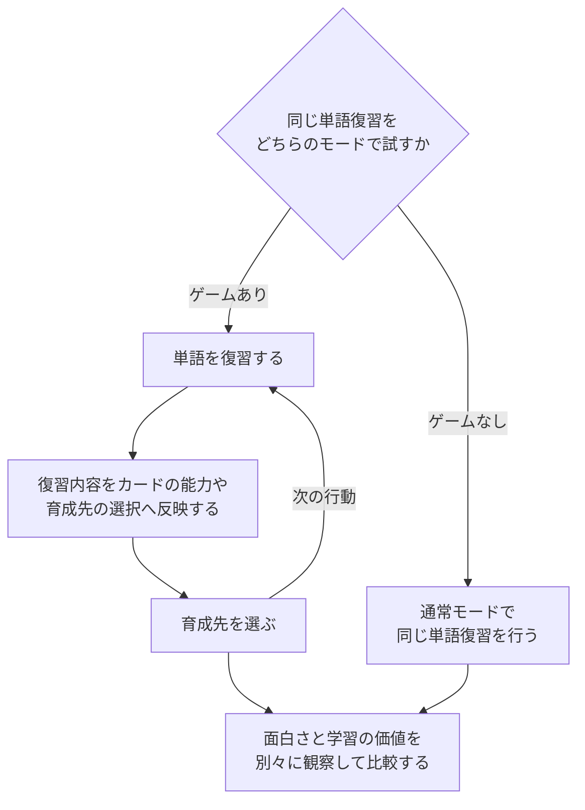

# サービスとゲーミフィケーションの設計

Mosaicで「何を作るか」を考え、操作できる小さな体験として比較するための企画モードです。生成、感想、改善、履歴はゲームと共通です。

|種類|整理すること|最初に試す体験|形式|
|---|---|---|---|
|ゲーム|テーマ・ルール・操作・成功/失敗・再挑戦|遊びの一巡|HTML / Unity / Avalonia|
|サービス|誰のどの困りごとを、どんな利用フローで変えるか|入力→操作→結果→編集・取消|HTML / Avalonia|
|ゲーミフィケーション|どの領域のどの行動に、どのゲームの仕組みを接続するか|行動→ゲーム反映→選択→再試行、通常モードとの比較|HTML / Unity / Avalonia|

## サービスの項目

10カテゴリ・60項目を用意しています。

|カテゴリ|判断する内容|
|---|---|
|サービスの仮説|サービスの種類、困りごと、価値の仮説、既存手段との差|
|利用者と利用場面|最初の利用者、きっかけ、頻度、環境、妨げとなる原因|
|価値と検証|利用後の変化、中心行動、初回価値、根拠、成功・見直しの基準|
|主要な利用フロー|入口、操作順、入力、結果、編集・取消、初回の案内|
|画面と情報|画面、移動、情報の優先順位、空の状態、失敗時の案内、文章|
|機能とデータ|必須機能、データ、サンプル、保存範囲、検索、自動化|
|SNS・共同利用|交流の必要性、投稿、人のつながり、会話、非表示・通報、公開範囲|
|信頼と利用者の選択|デモ認証、権限、個人情報、体験上の不安、外部連携、料金の仮説|
|見た目と使いやすさ|デザイン、レイアウト、アクセシビリティ、言語、操作への反応、素材|
|モックの範囲と試し方|実装範囲、除外、疑似実装、シナリオ、利用後の質問、次の判断|

SNSが必要な場合だけ交流機能を採用します。個人用ツールへ自動的にフィードやフォローを追加する指示にはしていません。ログイン・決済・送信などは架空データによるローカルのデモとして表示します。

## ゲーミフィケーションの項目

ゲームの163項目に4カテゴリ・26項目を追加し、計22カテゴリ・189項目を編集できます。

|カテゴリ|判断する内容|
|---|---|
|領域と行動|領域、対象者、具体的な場面、変えたい行動、妨げ、ゲーム外の価値|
|行動とゲームの接続|ゲームの仕組み、行動との対応、体験ループ、選択、報酬、進歩、再開|
|参加の選択と限界|ゲームのオン/オフ、協力・競争、負担、目的とのずれ、データ、使いやすさ|
|比較と検証|効果の仮説、通常モードとの比較、観察指標、見直す条件、シナリオ、規模、次の判断|

「学習全体をゲームにする」から始めず、「帰宅後の単語復習へ取りかかる瞬間」のように場面を絞ります。ポイントを表示するだけでなく、復習の内容がカードの能力や育成先の選択へ反映されるところまでを試します。ゲームなしの通常モードでも同じ復習ができるようにし、面白さと学習の価値を別々に観察します。

単語復習を例に、同じ中心行動をゲームあり・なしで試し、面白さとゲーム外の価値を比較する設計を示します。

## 案を出発点にする

「アイデアを探す」には、サービス5案、ゲーミフィケーション4案、ゲーム1案を内蔵しています。案は効果が未検証の仮説で、AIがその場で調査・評価した結果ではありません。選んだ案から新しい企画を作り、対象や場面を変更してください。空欄はAIに補完させられます。

- サービス：地域の助け合いSNS、食材の使い忘れ防止、仕事の引き継ぎ、つまずきからの復習、選択肢の比較。
- ゲーミフィケーション：復習×デッキ構築、片付け×拠点づくり、作業分割×探索マップ、地域への関心×発見図鑑。

## 検証メモと改善

サービスとゲーミフィケーションでは `experiment.md` を必須成果物にします。仮説、試す操作、観察指標、利用後の質問、見直す条件、次に決めることを記録します。ゲーミフィケーションには行動とゲームの対応、ゲームなしとの比較、負担や目的からのずれも含めるよう指示します。

検証メモの存在・空でない内容はアプリで検査します。仮説の妥当性、体験の面白さ、効果の有無、生成した画面の操作成功を機械的に保証するものではありません。実際に試した感想を履歴ごとに残し、改善へつなげてください。

改善時は元のメモを `baseline-experiment.md` に分離し、新しいメモを要求します。履歴の種類と形式を固定し、現在編集中の別企画を取り込みません。元の成果物も書き換えません。

## 保存の互換性

企画・セッションのVersionを2に更新しました。Kindはゲーム=0、サービス=1、ゲーミフィケーション=2です。Version 1はゲームとして読み、未知の項目・ジャンル・形式・履歴・感想を引き継ぎます。Version 2は旧アプリでは読み込めません。

セッションは現在の企画と種類別の下書きを保持します。種類の切り替え・企画の読込・案の採用前に入力をRecoveryへ退避します。案や補完企画で置き換える場合にも、別の種類で編集していた下書きを復旧できるよう残します。
