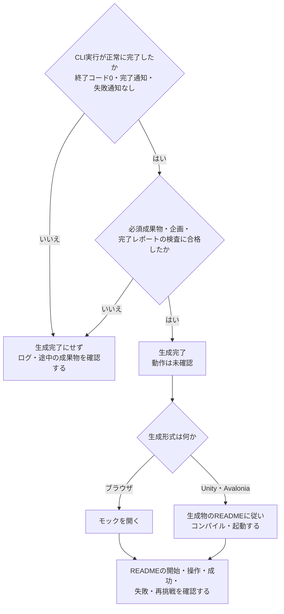

# 受け入れ確認

2026-09-12、macOS arm64 / .NET SDK 10.0.300 / アプリ対象net8.0で確認。

## サービスとゲーミフィケーション

- Release・NuGet監査込みの自動テストは **84件成功、失敗0、スキップ0、警告0**。既存64件に、種類別の下書き保存、旧セッションの移行、案の取り込み、別種類の企画置換時の復旧、種類を取り違えない新規生成・改善などの回帰検証を追加。
- 旧Version 1の企画・セッションから、ジャンル・生成形式・未知の項目・履歴・感想を保ってVersion 2へ移行することを確認。下書きの重複や不正なKind、サービスへのUnity・ゲームジャンル混入を拒否する。
- 偽CLIでサービス・ゲーミフィケーションの生成から改善まで実プロセス経由で確認。前回のexperiment.mdだけでは改善完了にならず、新しい検証メモを要求する。元のファイルを変更しない。
- Mac実画面で3種類の切り替え、サービス60項目・ゲーミフィケーション189項目の表示、内蔵案の採用、編集・生成ボタンの切り替え、サービスでUnityを選べないことを確認。
- 最終版Macアプリを再生成して再起動。サービスとゲーミフィケーションそれぞれの下書き、以前のゲーム履歴・感想を復元。サービスを編集中でも履歴のゲームを改善対象にし、そのゲーム向けの指示を表示することを確認。
- ソースの85テキストファイルを既知の秘密値形式で検査し、候補なし。Macアプリ内の218ファイルにも認証・セッション・秘密鍵のファイル名候補なし。これは未知の問題がないことを保証する検査ではない。
- ログイン済みGPT-6 xhighでサービスの新規生成が完了。食材の登録→期限順の一覧→選択→使用済み→取消を扱うモックで、60項目、明示指定、Kind=Service、Genres=[]、完了レポート、検証メモの検査を通過。JavaScriptの構文検査も成功。
- ゲーミフィケーションの新規生成は20分上限で停止し、成功扱いにしなかった。停止時には単語復習→カード育成→模擬戦、通常モード、全189項目、検証メモと完了レポートが存在し、アプリと同じArtifactValidatorによる別途のファイル検査とJavaScript構文検査は通過した。CLIのターン完了とは区別する。
- この実測を受け、アプリの実行上限を30分へ調整。無期限実行・モデル変更・自動再試行は追加していない。時間切れ時の停止と成果物保持は既存の実プロセステストで検証し、表示にも上限を示す。
- ファイル検査済みのゲーミフィケーションを別フォルダへコピーし、GPT-6 xhighで案内文の実改善が完了。終了コード・turn.completed・新しい検証メモを含む必須成果物・全189項目・元の未知キー保持の検査を通過。HTML差分はモード切替そばの案内1文だけで、企画の関連5項目を更新した。JavaScript構文検査にも成功。元フォルダ全10ファイルのSHA-256は実行前後で一致し、追加・削除・変更なし。
- 実生成はアプリと同じCodexCommand／CodexRunner／ArtifactValidatorを呼ぶ一時確認コードから実施し、利用中の企画・履歴へ確認用データを混入させていない。出力はローカルの `artifacts/planning-smoke/Service/`、`Gamification/`、`Gamification-refined/` に保存。成果物・ログは公開コミットの対象外。
- UI証跡： [サービスの案](https://raw.githubusercontent.com/MasaKoha/Mosaic/e6d523933b26e445c6fef5356711553d3a2837cf/service-gamification/service-ideas.png)、[サービスの編集](https://raw.githubusercontent.com/MasaKoha/Mosaic/e6d523933b26e445c6fef5356711553d3a2837cf/service-gamification/service-editor.png)、[ゲーミフィケーションの案](https://raw.githubusercontent.com/MasaKoha/Mosaic/e6d523933b26e445c6fef5356711553d3a2837cf/service-gamification/gamification-ideas.png)、[ゲーミフィケーションの編集](https://raw.githubusercontent.com/MasaKoha/Mosaic/e6d523933b26e445c6fef5356711553d3a2837cf/service-gamification/gamification-editor.png)。

## 生成失敗時の通知順

- PR #4のCIは64件成功したが、マージ後CIで改善失敗時のUIテストが1件失敗した。CLIが短時間で失敗すると、`ObserveOn`が未処理の開始通知よりエラーを先に配送し、失敗履歴を作れずに元ゲームを選んだままになる競合だった。
- インストール済みRx.NET 6.1.0と制御可能なスケジューラで、修正前は`Failed`だけ、修正後は`Prepared → Failed`になることを再現した。`Materialize → ObserveOn → Dematerialize`で終端も通常通知として配送する。
- 修正後、Release・NuGet監査込みで64テスト全成功。失敗したUI回帰テストを別プロセスで20回連続実行し、20回とも成功。既存テストがこの競合の回帰を守るため、同じ振る舞いのテストは追加していない。

## 感想からのブラッシュアップ

- Releaseの自動テストは **64件成功、失敗0、スキップ0、警告0**。NuGet監査を含む `-p:AuditPipeline=true` で実行。
- 新たに守る振る舞い: 感想の自動保存と終了直前の復元、履歴切り替え時の下書き維持、元ゲームの形式による改善、新規企画の下書き保護、失敗後の再編集、改善元・適用済み感想の履歴保存。
- 偽CLIで、コピー済みゲームの変更と再改善、未知項目の保持、前回レポートだけでは完了しないこと、コピーの取消、秘密情報・キャッシュ除外、起動スクリプトの実行権限継承を確認。
- コピー先が元ゲーム配下の場合、シンボリックリンク経由の場合、対象にリンクがある場合、容量上限を超える場合をCLI起動前に拒否することを確認。Macの`/var`と`/private/var`が混ざる別名パス判定の漏れを検出・修正し、回帰テストを追加。
- Mac実画面で感想入力、下書きの自動保存と再起動時の復元、生成中の入力制限、改善完了履歴を確認。最終版のMacアプリを再生成し、元ゲームと改善版を切り替えて下書き・適用済み感想が別々に復元されることを確認。
- **アプリの改善ボタンからGPT-6 xhighによる実改善1件が完了**。「星を3個から5個へ変更し、獲得数と目標を表示。既存の見た目・無音・失敗・リトライを維持」という入力を使用。終了コード・ターン完了・必須成果物・企画・完了レポートの検査を通過した。
- 改善したHTMLの差分で目標数と関連表示の変更を確認。元のCSS・星SVGを維持。企画は163項目を保持し、関連19項目を更新した。元フォルダ全10ファイルのSHA-256を実行前後で照合し、追加・削除・変更なし。
- 実改善先: ドキュメントフォルダ内 `GameMockStudio/Generated/mock-20260912-135141-8cb56124e7d949bfa95913eef5639841/`。感想・改善元・前回資料・今回の企画・レポート・ログを保存。
- 公開対象72テキストファイルに既知の秘密値形式の検出なし。感想・改善用資料の除外を確認し、アプリ219ファイルにも認証・保存・秘密鍵のファイル名候補なし。
- ゲームのブラウザ実操作は未実行。エディタからの改善フローと成果物の静的検査を、プレイ確認と区別する。

## GPT-6 xhighと公開用保護の確認

- `dotnet test tests/GameMockStudio.Tests.csproj --configuration Release --nologo -v minimal -p:AuditPipeline=true`: **53件成功、失敗0、スキップ0、警告0**。既存のCLI引数境界テストにxhigh・個人設定非読込・権限と環境変数の制限を反映。
- ローカルの `codex login status` はChatGPTでログイン済み。認証ファイルは読み取らず、アプリの `CodexCommand` / `CodexRunner` から実CLIを起動。
- 実行セッションの設定で `gpt-6-astra`、`xhigh`、承認拒否、workspace-write、network_access=falseを確認。
- 確認用に5分へ短縮した実生成は時間切れで停止。接続と設定適用は確認できたが、生成完了とは扱わない。アプリ本体の上限は20分。
- 確認用コードも既定の20分上限へ合わせて再実行し、**xhighでの実生成1件が成功**。終了コード0、turn.completed、必須成果物、163項目の補完、明示指定の維持、完了レポートの検査をすべて通過。診断ログは空。出力は `artifacts/xhigh-smoke/mock-20260912-125908-f9f33214f0434cee872d90fde7fc1953/`。画面と同じ `CodexCommand` / `CodexRunner` を呼ぶ一時確認コードから実行し、利用者の企画・履歴は変更していない。
- Macアプリの再生成、実画面のxhigh表示と認証説明を確認。アプリの219ファイルに認証・自動保存・秘密鍵のファイル名候補はなし。
- 公開履歴の64テキストblobと作業ツリーに、既知の秘密値形式の検出なし。生成物・認証・復旧データなど12パターンを `git check-ignore` で確認。
- NuGetの直接・間接依存の監査に成功し、既知の脆弱性は検出なし。CI用のNU1900〜NU1905のエラー化を実効プロパティで確認。
- GitHubのSecret scanning・push protection・Dependabot alerts/security updates・非公開脆弱性報告を有効化済み。確認時点のアラートは0件。これは将来の検出や未知の問題がないことを保証しない。

## 実行結果

- `dotnet test tests/GameMockStudio.Tests.csproj --nologo -v minimal`: **53件成功、失敗0、スキップ0、警告0**。
- 画面のヘッドレステスト7件: 入力直後の終了と再起動、自動保存、初期復元中の終了、破損保存の退避、新規企画の退避、補完企画の取り込み、保存失敗からの再編集・再試行、読取権限エラー時の操作と明示的な終了を確認（1ケースで複数観点）。
- 偽CLIの実プロセステスト: 標準入力の文字列維持、約300KBの標準エラー出力、異常終了、完了通知不足、ログ保存失敗、取消時の子孫停止、2秒設定での時間切れを確認。
- `sh tools/package-macos.sh`: Releaseの自己完結アプリ生成成功。
- macOSの実画面: 起動、日本語入力、指定件数更新、自動保存、生成中の入力制限、完了履歴、補完済み企画の取り込み（163/163）、取り込み前の退避、新規企画への切り替えを確認。
- **実モデルのブラウザ生成1件成功**。Codex gpt-6-astra / highで「星ひろい（動作確認サンプル）」を生成し、完了レポート・必須ファイル・163項目の補完・明示値維持の検査を通過。アプリに「生成完了」と表示され、履歴1件を保存。
- 最終版のMacアプリで、再起動後の復元と保存後の正常終了を確認。初期状態へ戻してもサンプルの履歴と成果物を保持。出力先は既定のDocumentsフォルダへ戻した。

実生成の出力: `artifacts/smoke/mock-20260912-102201-f5d5c36b66c84589acdf51e1b94381ea/`。入力、プロンプト、JSONL、診断、結果レポートを同じフォルダに保存。生成中に既存のMCP接続エラーが診断ログへ出たが、モデル処理と成果物検査は正常完了した。

## 未実行の確認事項

- サービス・ゲーミフィケーションを含む生成モックのブラウザ実操作。ブラウザ操作ツールがfile:// URLをセキュリティポリシーで拒否し、別経路での回避も禁止したため実施していない。HTMLの生成成功をプレイ確認済みとは扱わない。
- 実モデルによるUnity/Avalonia形式の生成、生成したプロジェクトのコンパイル・プレイ。
- Windows/Linuxの実画面、Windowsのプロセス停止。POSIXシェルに依存するテストはWindowsでは明示的にスキップする。
- 本番の認証切れ・利用上限の誘発、実CLIを現在の30分上限まで待つタイムアウト試験。
- すべての拡大率・最小ウィンドウサイズ・スクリーンリーダーでの操作。

## 手動回帰の確認観点

以下は今後の手動回帰にも利用する確認表。上の実行結果と別に、全行を実行済みとするものではない。

|対象|操作|期待結果|
|---|---|---|
|起動|dotnet run --project GameMockStudio.csproj|3列の画面が開き、163項目がカテゴリで切り替わる|
|全空欄|何も入力しない|全項目がランダム、ジャンルもランダムと表示|
|空白|項目にスペース・改行だけ入力|指定済みに数えず、プロンプトではランダム|
|不採用|戦闘方式に「なし」|指定済みになり、生成企画でも「なし」を維持|
|ジャンル|候補・自由入力で3種類指定|4つ目の入力欄はなく、重複は除去|
|検索|「カメラ」を検索|該当項目がカテゴリをまたいで表示|
|入力維持|カテゴリと検索を往復|入力した値が維持される|
|保存と読込|日本語・改行・引用符を含む企画を保存して読込|値、空欄、ジャンル、生成形式が一致|
|読込キャンセル|ダイアログをキャンセル|元の企画が維持される|
|不正JSON|不正JSON、ジャンル4種、将来Versionを読込|エラーを表示し元の企画を維持|
|安全な画面置換|入力後に新規・読込|元の入力がRecoveryに保存される|
|CLI不在|存在しないCLIパスで生成|エラー表示、再編集可能、再試行しない|
|認証・利用上限|CLIが認証・上限エラーを返す状態|ログが残り、成功扱いにしない、リセットしない|
|モデルと権限|プロセス引数を確認|gpt-6-astra、xhigh、workspace-write、approval_policy=never|
|正常生成|小さなHTMLゲームを生成|必須ファイルと補完企画の検証後に完了、ブラウザで開ける|
|指定維持|ジャンルと特徴を指定して生成|補完企画の明示値が入力と一致|
|成果物不足|CLI終了0でもindex.htmlや補完項目・完了レポートが欠落|生成未完了のエラー、成果物フォルダを開ける|
|時間上限|CLI実行が30分を超える|子孫プロセス停止、時間切れ表示、途中ファイル保持|
|取消|生成開始直後・実行途中でキャンセル|子プロセス停止、途中ファイル保持、次の生成が可能|
|終了|生成中にウィンドウを閉じる|購読解除、子プロセス停止|
|繰り返し生成|同じ入力で2回生成|別フォルダに出力、前回を上書きしない|
|Unity/Avalonia形式|形式を変更して生成|ソースとREADME出力、ツールはコンパイルや起動しない|
|画面|最小サイズと拡大表示、日本語入力|入力欄・ボタン・ログがスクロールで読める|

生成したゲームの動作確認は、ゲーム固有のREADMEにある開始・操作・成功・失敗・リトライを確認してください。



ゲームの新規生成を例に、生成完了の判定と、利用者が別途行う起動・操作確認の流れを示します。

## 自動テスト

再実行するコマンド:

```sh
dotnet test tests/GameMockStudio.Tests.csproj
```

空白と不採用の区別、外部JSONの検証、ジャンル上限、引数境界と固定モデル、CLIの未知出力と失敗保持、成果物の不足と指定変更を対象にしています。実モデルへの通信やUnityの起動は行わないテストです。
